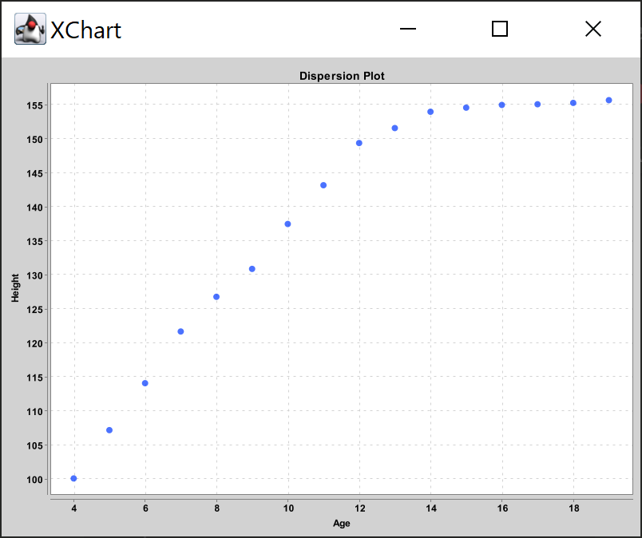

# Regression

This is an implementation of *Simple Linear Regression* reading an input file in CSV format such as

| Age | Height |
| --- | --- |
| 4 | 100.1 |
| 5 | 107.2 |
| 6 | 114.1 |
| 7 | 121.7 |
| 8 | 126.8 |
| 9 | 130.9 |
| 10 | 137.5 |
| 11 | 143.2 |
| 12 | 149.4 |
| 13 | 151.6 |
| 14 | 154.0 |
| 15 | 154.6 |
| 16 | 155.0 |
| 17 | 155.1 |
| 18 | 155.3 |
| 19 | 155.7 |
| Graph it |  |

..and showing a dispersion plot to check whether is meaningful to look for an equation in the form **y=ax+b**. 

<small>Where the variable **y** is indipendent and the variable  **x** is dipendent. In this equation the coefficent **a** is the regression and as usual gives the slope of the line.</small>

## Package
The code that performs simple linear regression is organized into a package containg three classes: Compute, DataCSV and Draw.

### Compute
- round()   **round with precision**
- invert()  **1/X**
- sumList() **column sum**
- avgList() **column average**
- tssList()  **Total Sum of Squares** or [TSS](https://en.wikipedia.org/wiki/Total_sum_of_squares)  

### DataCSV
- getIndexValue()
- getIndexValueInverted()

### Draw
- scatterPlot()

## Credits
[XChart](https://knowm.org/open-source/xchart/) a light-weight and convenient library for plotting data. Its focus is on simplicity and ease-of-use, requiring only two lines of code to save or display a basic default chart.

