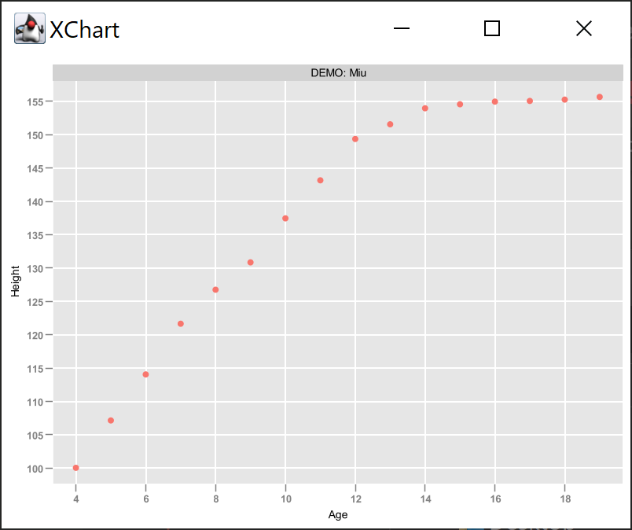
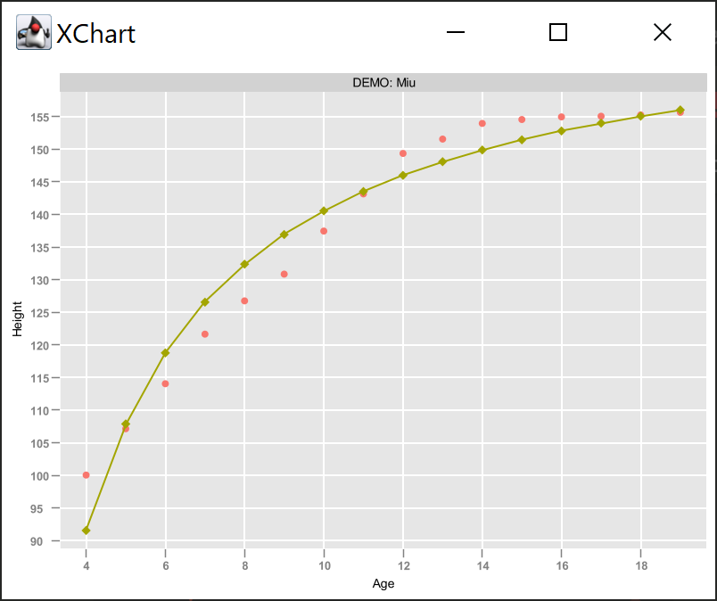
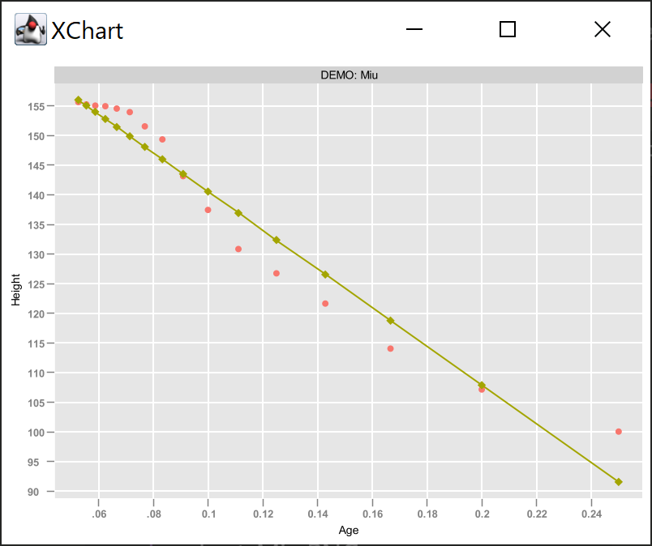

# Regression

This is an implementation of *Simple Linear Regression* reading an input file in CSV format such as

| Age | Height |
| --- | --- |
| 4 | 100.1 |
| 5 | 107.2 |
| 6 | 114.1 |
| 7 | 121.7 |
| 8 | 126.8 |
| 9 | 130.9 |
| 10 | 137.5 |
| 11 | 143.2 |
| 12 | 149.4 |
| 13 | 151.6 |
| 14 | 154.0 |
| 15 | 154.6 |
| 16 | 155.0 |
| 17 | 155.1 |
| 18 | 155.3 |
| 19 | 155.7 |
| Graph it |  |

..and showing a dispersion plot to check whether is meaningful to look for an equation in the form **y=ax+b**. 

<small>Where the variable **y** is indipendent and the variable  **x** is dipendent. In this equation the coefficent **a** is the regression and as usual gives the slope of the line.</small>

Then computing for each row [SSD](https://www.investopedia.com/terms/s/sum-of-squares.asp) and [RSS](https://en.wikipedia.org/wiki/Residual_sum_of_squares).

| | Age | 1/age | Height |
| --- | --- | --- | --- |
| sum | 184.0 | 1.7144 | 2212.2 |
| avg | 11.5 | 0.1072 | 138.3 |
| ssd | | 0.0489 | 5464.4575 |

| rss |
| --- |
| -15.9563| |

| | coefficent |
| --- | --- |
| **a** <small>&sum;xy &sum;xx</small> | -326.6 |
| **b** <small>avgY-avg1/age*a</small> |  173.3 | 

| equation | chart | 1/age |
| --- | --- | --- |
| **y** = -326.4**x** + 173.3 |  | 

| regression coefficent |
| --- |
| **R** = 0.9766 |
| **R**2 = 0.9537 |

## Use
Simple as that
>        DataCSV data = new DataCSV();
>        data.load("ageMiu.csv");
>        data.show();
>        data.compute(0,true,1);

>        System.out.format("%10s %10s %10s\n","Age","1/age","Height");
>        System.out.format("sum %6s %10s %10s\n",data.getSumX(0),data.getSumInvX(4),data.getSumY(0));
>        System.out.format("avg %6s %10s %10s\n",data.getAvgX(1),data.getAvgInvX(4),data.getAvgY(1));
>        System.out.format("ssd %17s %10s\n",data.getSsdX(4),data.getSsdY(4));
>        System.out.println();
>        System.out.format("rss %17s\n",data.getRss(4));
>        System.out.format("a %19s\n",data.getA(1));
>        System.out.format("b %19s\n",data.getB(1));
>        System.out.println();
>        System.out.format("y = %sx + %s\n",data.getA(1),data.getB(1));        

>        System.out.println();
>        System.out.format("%20s\n","Regression");
>        System.out.format("r %19s\n",data.getR(4));
>        System.out.format("r2 %18s\n",data.getR2(4));

>        Draw scat = new Draw();
>        scat.scatterPlot(data.getX(),data.getY(), new String[] {"Dispersion Plot","Age","Height"});

## Package
The code that performs simple linear regression is organized into a package containg three classes: Compute, DataCSV and Draw.

### DataCSV
- load()    read **CSV**
- show()    prints loaded **data**
- compute() **execute** linear regression
- *Getters* (public)
    - x **independent** variable list
    - invX  **1/X** (when needed)
    - y **dependent** variable list
    - sumX, sumInvX, sumY   list **sum**
    - avgX, avgInvX, avgY   list **average**
    - ssdX, ssdY    **S**um of **S**quared  **D**eviations
    - rss  **R**esidual **S**um of **S**quares
    - a, b  coefficents of y=**a**x+**b**
    - R, R2  **regression** coefficent
- *Methods* (private)
    - getIndexValue()
    - getIndexValueInverted()
    - round()   **round with precision**
    - sumList() column **sum**
    - avgList() column **average**
    - ssdList()  **S**um of **S**quared  **D**eviations
    - rssList()  **R**esidual **S**um of **S**quares

### Draw
- scatterPlot()

## Credits
Inspiration for this Java coding challenge comes from [The Manga Guide to Regression Analysis](https://nostarch.com/regression) published in Italian by Le Scienze/La Repubblica (NO STARCH PRESS and Ohmsha Ltd.) in 2016.<small>
>Like a lot of people, Miu has had trouble learning regression analysis. But with new motivation—in the form of a handsome but shy customer—and the help of her brilliant café coworker Risa, she’s determined to master it.</small>

Charts built with [XChart](https://knowm.org/open-source/xchart/) a light-weight and convenient library for plotting data.<small> 
>Its focus is on simplicity and ease-of-use, requiring only two lines of code to save or display a basic default chart.
</small>
