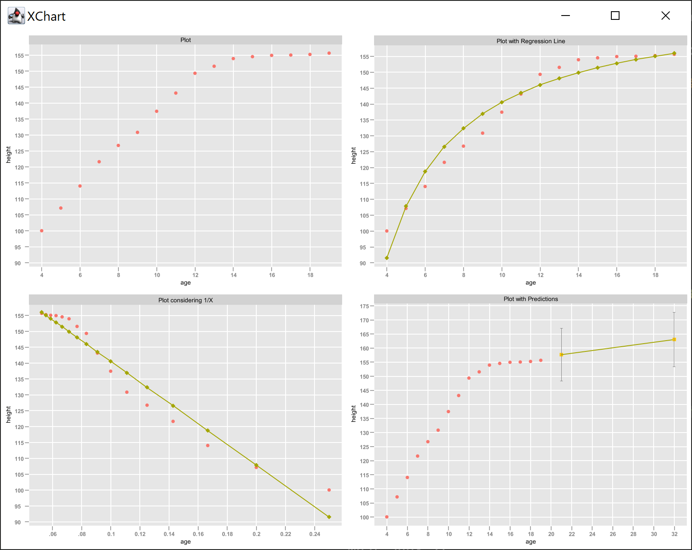

# Regression

This is an implementation of *Simple Linear Regression* reading an input file (in CSV format) containing samples. 

<small>

>Here we qoute the example of Miu's *age* and *height* from 4 to 19 years old: (4,100.1), (5,107.2), (6,114.1), (7,121.7), (8,126.8), (9,130.9), (10,137.5), (11,143.2), (12,149.4), (13,151.6), (14,154.0), (15,154.6), (16,155.0), (17,155.1), (18,155.3), (19,155.7).

</small>

First of all all computations are carried out and then a graph is automatically created with a *dispersion plot*, another with also the *regression line*, and finally if needed also the 1/X.  

>

Predictions are carried out from the regression equation in the form **y=ax+b**. 

<small>

>Where the variable **y** is indipendent and the variable  **x** is dipendent. In this equation the coefficent **a** is the regression and as usual gives the slope of the line.

</small>

The compute() method calculates all variables to describe statistically samples and perform regression analysis.

<small>

>| | Age | 1/age | Height |
>| --- | --- | --- | --- |
>| sum | 184.0 | 1.7144 | 2212.2 |
>| [avg](https://en.wikipedia.org/wiki/Mean "actually this is called the Mean") | 11.5 | 0.1072 | 138.3 |
>| min | 4.0 | 0.0526 | 100.1 |
>| max | 19.0 | 0.25 | 155.7 |
>| [med](https://en.wikipedia.org/wiki/Median "actually this is called the Median") | 11.5 | 0.0871 | 146.3 |
>| [ssd](https://www.investopedia.com/terms/s/sum-of-squares.asp "actually this is called sum of squared deviations") | | 0.0489 | 5464.4575 |
>| [usv](https://en.wikipedia.org/wiki/Degrees_of_freedom_(statistics) "actually this is called unbiased sample variance or degree of freedom") | 10.0 | | 169.9 |

>| [rss](https://en.wikipedia.org/wiki/Residual_sum_of_squares) |
>| --- |
>| -15.9563| |

>| | coefficent |
>| --- | --- |
>| **a** <small>&sum;xy &sum;xx</small> | -326.6 |
>| **b** <small>avgY-avg1/age*a</small> |  173.3 | 

>| [equation](https://en.wikipedia.org/wiki/Simple_linear_regression) |
>| --- |
>| **y** = -326.4**x** + 173.3 |

>| | ŷ |
>| --- | --- |
>| avg | 138.3 |
>| ssd | 5211.7 |
>| &Sigma;yŷ | 5211.7 |

>| correlation |
>| --- |
>| [**R**](https://en.wikipedia.org/wiki/Correlation_coefficient) = 0.9766 |
>| [**R**2](https://en.wikipedia.org/wiki/Coefficient_of_determination) = 0.9537 |

>| | confidence |
>| --- | --- |
>| Se | 252.8 |
>| &sigma; | 4.2 |
>| anova | 288.6 |

</small>

In this specific case there is one and only Miu, so with such correlation coefficent we can be confident to make good predictions about her height in the future. 

What if the samples re not the whole population? We carry out **variance analysis** and we calculate the **confidence intervals**.

>

Try out Risa's tea house data file and look at further figures in order to be sure about making good predictions. 

## Usage
Run like any Java program, specify the data file **.csv**, X column (**0** default), Y column (**1** default), **true** for 1/X (when X is not linear).
> java *SimpleLinearRegression* **ageMiu.csv 0 1 true**

> java *SimpleLinearRegression* **teaHouse.csv 1 2**

> java *SimpleLinearRegression* **airPreassure.csv**

## Package
The code that performs simple linear regression is organized into a package containg two classes: DataCSV and Draw.

### DataCSV
- load()    read **CSV**
- show()    prints loaded **data**
- compute() **execute** linear regression
- *Getters* (public)
    - x **independent** variable list
    - invX  **1/X** (when needed)
    - y **dependent** variable list
    - sumX, sumInvX, sumY   list **sum**
    - avgX, avgInvX, avgY   list **average**
    - ssdX, ssdY    **S**um of **S**quared  **D**eviations
    - rss  **R**esidual **S**um of **S**quares
    - a, b  coefficents of y=**a**x+**b**
    - R, R2  **regression** coefficent
- *Methods* (private)
    - getIndexValue()
    - getIndexValueInverted()
    - round()   **round with precision**
    - sumList() column **sum**
    - avgList() column **average**
    - ssdList()  **S**um of **S**quared  **D**eviations
    - rssList()  **R**esidual **S**um of **S**quares

### Draw
- scatterPlot()

## Credits
Inspiration for this Java coding challenge comes from [The Manga Guide to Regression Analysis](https://nostarch.com/regression) published in English by NO STARCH PRESS and Ohmsha Ltd.

<small>

>Like a lot of people, Miu has had trouble learning regression analysis. But with new motivation—in the form of a handsome but shy customer—and the help of her brilliant café coworker Risa, she’s determined to master it.
</small>

Expressive charts built with [XChart](https://knowm.org/open-source/xchart/) a light-weight and convenient library for plotting data.

<small> 

>Its focus is on simplicity and ease-of-use, requiring only two lines of code to save or display a basic default chart.
</small>

Wonderful coding experience on Microsoft [Visual Studio Code](https://code.visualstudio.com/) IDE and [Java Extension Pack](https://marketplace.visualstudio.com/items?itemName=vscjava.vscode-java-pack).

<small>

>According to a survey done by Stack Overflow in 2018 VSC was ranked the most popular developer environement tool.

</small>

Last but not least the unmistakable [AdoptOpenJDK](https://adoptopenjdk.net/) 8.

<small>

>AdoptOpenJDK provides rock-solid OpenJDK binaries for the Java ecosystem and also provides infrastructure as code, and a Build farm for builders of OpenJDK, on any platform.

</small>